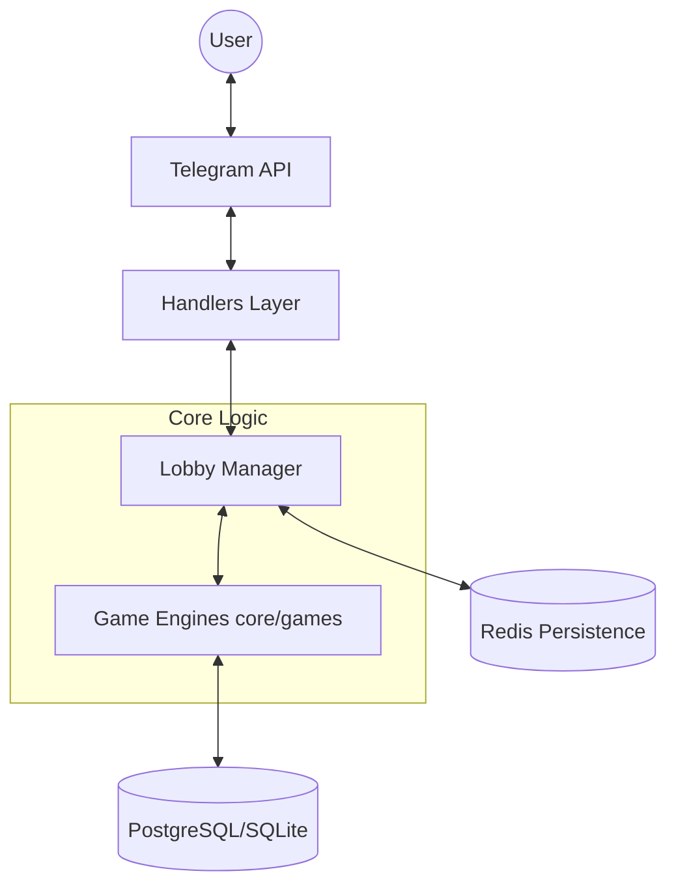

# ClassicPlayBot 🎮

**A modular Telegram gaming platform with a rich virtual economy and complex card game engines built on Python and aiogram 3.x.**

> [!NOTE]
> This is a **showcase repository** containing documentation, architecture design, and features list for the private `ClassicPlayBot` engine.

---

## 💎 Engineering Excellence

This project is built using modern Python development best practices:

*   **Robust Test Suite**: Covered with **80+ automated tests** (Pytest), including Unit testing, integration tests for Telegram handlers, and stress tests for the card engine.
*   **State Persistence**: All active games are persistent via **Redis**. The bot can restart at any moment without players losing their active game state.
*   **CI/CD Pipeline**: GitHub Actions are set up for automated testing (Linting + Testing) on every Pull Request.
*   **Clean Architecture**: Separation between the Telegram interface layer (`handlers/`), game business logic engines (`core/games/`), and DB service layer (`core/services/`).
*   **Performance First**: Built fully asynchronously (`asyncio`) and using optimized DB queries via SQLAlchemy 2.0.

---

## ✨ Features & Modules

### 💰 Virtual Economy & Shop
- **Currency System**: Custom economy featuring multiple currencies (Gold, Gems, Bitcoin, Toncoin).
- **Interactive Shop**: Ability to buy, own, and sell assets across categories:
  - *Phones* (from Nokia 3310 to iPhone 15 Pro Max)
  - *Cars* (Audi Q7, BMW X6, Mercedes S63, Rolls-Royce)
  - *Houses* (Apartments, Villas, Mansions, Mars base)
  - *Yachts* (Bavaria 40, Princess 60, Eclipse)
- **Passive Income & Mining**: Purchase businesses (Cafes, Nightclubs) and mining farms (TI-Miner, Saturn) to generate hourly income.
- **Power Plants**: Build Wind, Solar, or Nuclear power plants to manage and sell energy.
- **Daily Bonuses & Inventory**: Interactive player profiles and item management.

### 🎮 Premium Card Game Engines
- **Universal Card System**: Fully modular deck, card, and hand representation that can be reused for any card game.
- **Lobby Manager**: Handles game matchmaking and supports adding/removing AI bots to fill lobbies with one click.
- **Durak (Дурень) Engine**:
  - Classic & Pro rules supported.
  - Custom game timers for turns (FSM).
  - *Cheating mechanics*: Allows players to sneak cards out of turn with a risk of getting caught by others clicking the "🤡 Caught Cheating!" button.
  - *Visual enhancements*: Inline player tags placed next to cards on the active table message.
  - Auto-cleanup of chat messages to keep groups tidy.

---

## 📁 Architecture & Directory Layout



```
ClassicPlayBot/
├── bot/                   # entry point
├── core/                  # Business logic
│   ├── models/            # User, Inventory, Assets models
│   ├── services/          # UserService, EconomyService
│   └── games/             # Game Engines
│       ├── base/          # Card, Deck, LobbyManager base classes
│       └── durak/         # Durak game loop & logic
├── handlers/              # Telegram handlers & controllers
│   ├── start.py           # Start handler
│   ├── economy/           # Shop, Inventory, Bonuses handlers
│   └── games/             # Durak interface handlers
├── database/              # SQLAlchemy models & migrations
└── config/                # Items list, localizations, settings
```

---

## 🎯 Ready for Web Integration

The game and economy core logic are completely decoupled from Telegram and the `aiogram` API. This architecture makes it extremely easy to scale:
- ✅ Telegram bot interface.
- 🔄 FastAPI REST API (can be plugged directly into `core/`).
- 🔄 WebSockets for real-time multiplayer browser play.

```python
# The same core logic works anywhere!
from core.games.durak.engine import DurakEngine

# Current Telegram lobby
game = DurakEngine(game_id, creator)

# Future FastAPI WebSocket route
@app.websocket("/ws/durak/{game_id}")
async def durak_websocket(websocket: WebSocket, game_id: str):
    # Uses the exact same DurakEngine instance!
    ...
```

---

## 🛠️ Stack & Technologies

*   **Python 3.11+**
*   **aiogram 3.15** (Telegram framework)
*   **SQLAlchemy 2.0** (Async ORM)
*   **Redis** (State persistence)
*   **Pytest** (Testing suite)
